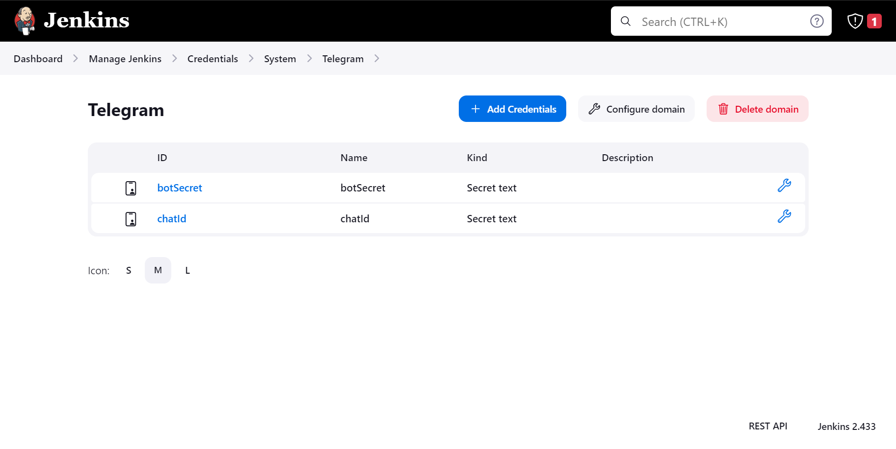
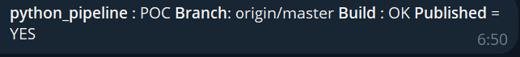

# test_only
Перед запуском необходимо:
1) Открыть чат с https://t.me/BotFather
2) /start
3) /newbot
4) Имя бота
5) Получаем токен
6) Создаем в jenkins 2 credentials

7) После запуска pipeline должны получить следующее сообщение

